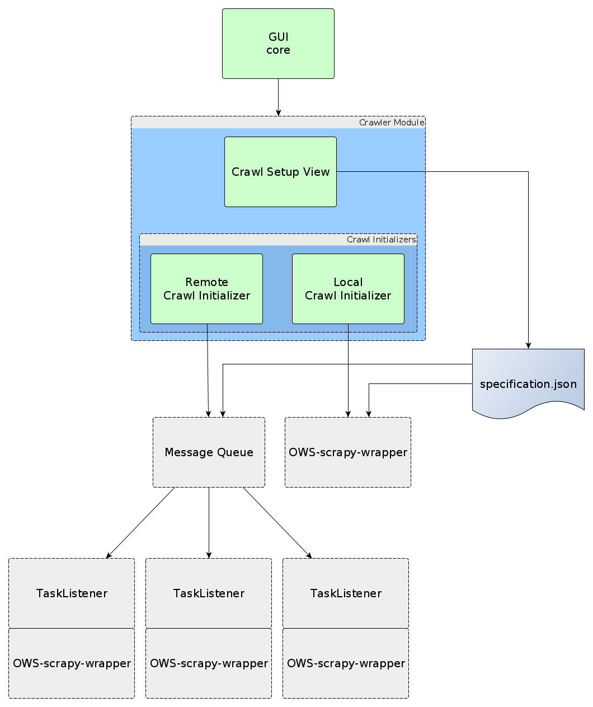

# OpenWebScraper

This is a simple modular graphical user interface (GUI) for the [Scrapy](https://scrapy.org/) python web-scraping
 library.
It allows to issue crawls with a basic list of urls and regex-blacklist/-whitelist and the options to either crawl
 for specified xpath-expressions or to crawl the raw html-content from the given urls.
It will also support several post-processing and analytical features that are heavily based on the [pandas](http://pandas.pydata.org/) library.
Hereinafter, OWS is short for OpenWebScraper.

This project comprises solely the graphical endpoint to configure the behavior of the scrapy
webscraping library. To execute crawls on your local machine, you also require
the [OWS-scrapy-wrapper](https://github.com/MaxPensel/OWS-scrapy-wrapper).
These components have been kept separately, because, in the future, OWS will also allow to issue crawls remotely vie
http-request, thus not requiring to install OWS-scrapy-wrapper locally. 


## Remarks

This software is still in early development. It is primarily developed with windows users in mind.
Seeing as python, PyQt5, etc. are platform independend, it should run on unix-based systems as well, although this is not extensively tested yet.

As a user, if you encounter any bugs or unexpected behaviour, please report them through github issues.
A simple in-app documentation is still planned to provide explanations for
the behavior of some of the UI features.

As a developer, be aware that some of the design choices may not be fully incorporated at every level yet.
There is some code documentation, but as is to be expected of an early development stage, it is most likely insufficient to fully understand everything.
Feel free to contact me with specific questions.

# Installation from Source

Check out the latest [release](https://github.com/MaxPensel/OpenWebScraper/releases)
of OWS for Windows 10, 64-bit compiled binaries. They do not require 
installation and are good-to-go.

For python adepts, the `requirements.txt` is complete, either install those requirements in your global or virtual
environment.
For people not too familiar with python, follow the steps below. 

Keep in mind, that the release, as well as the installation from source only contains the OpenWebScraper user
interface.
It does not contain the functionality to crawl on its own.
Follow the instructions in [Interaction with OWS-scrapy-wrapper](#interaction-with-OWS-scrapy-wrapper) to connect
OWS to the separate [scrapy crawler library wrapper](https://github.com/MaxPensel/OWS-scrapy-wrapper).

## Preparation

1.  Install Python 3.7.5 from the official website (select "put python on PATH" option during installation)
2.  Download the sources either from the master branch or from the release of your choice.
3.  Unizp sources in your installation location.

## Installation
The following steps require the use of a command prompt (windows: cmd, powershell; unix: bash, sh).
Please consult the respective tutorial resources to acquaint yourself with the basics of command prompt interaction
 (e.g. changing directories, creating directories, executing commands).
 
4.  Navigate (cd) to the root of the directory containing your unzipped OWS sources.
5.  Create a virtual environment:
   
    Windows:
    ```
    python -m venv venv
    ``` 
    
    Linux / Mac:
    ```
    python3 -m venv venv
    ```
6.  Activate that environment:

    Windows:
    ```
    .\venv\Scripts\activate.bat
    ``` 
    
    Linux / Mac:
    ```
    . ./venv/bin/activate
    ```
    
    To verify, it should say '(venv)' in from of your command line now.

7.  Install requirements:

    Any platform:
    ```
    pip install -r requirements.txt
    ```

## Running OpenWebScraper

For now, Linux and Mac users need to run OWS from python source code each time.
For Windows users, there are two options for running OWS now (not counting directly downloading the compiled binaries
 and running those).
 
### Running OWS from Source

Use your favourite command prompt and make sure the correct virtual environment is active (see Installation Step 6
 above).
Navigate to `<installation-directory>/src` and run
```
python crawlUI.py
```

### Creating your own Binaries (Windows .exe)

Continuing after Installation Step 7, execute
```
pyinstaller OWS.spec
```
in the root of your installation directory.
This will create a `dist\OpenWebScraper\` directory in which you will find `OWS.exe`.
You can execute this of course without the command prompt, make a shortcut, etc.

# Interaction with OWS-scrapy-wrapper

At this point, OWS allows only to issue local crawls. As a planned feature
OWS will be able to report crawl specifications to arbitrary endpoints via http.

To issue local crawls you need to install the standalone [OWS-scrapy-wrapper](https://github.com/MaxPensel/OWS-scrapy-wrapper)
and confiure OWS so that it will be able to execute OWS-scrapy-wrapper.
This configuration can be adjusted from within the UI `Settings > Crawler`.
You need to configure `scrapy_wrapper_exec` to a command that correctly executes the OWS-scrapy-wrapper.
The simplest option (in windows) would be to provide the path to the binary file, e.g.
```C:\Path\To\OWS-scrapy-wrapper.exe```.
Hoever, in case you need to use the sources, install OWS-scrapy-wrapper just like you installed OWS, and configure
the setting `scrapy_wrapper_exec` to:

Windows:
```python
scrapy_wrapper_exec = '<OWS-scrapy-wrapper-dir>\\venv\\Scripts\\python.exe <OWS-scrapy-wrapper-dir>\\src\\scrapy_wrapper.py'
```

Linux / Mac:
```python
scrapy_wrapper_exec = '<OWS-scrapy-wrapper-dir>/venv/bin/python <OWS-scrapy-wrapper-dir>/src/scrapy_wrapper.py'
```

# Documentation

This is a preliminary documentation about the code structure and some module interactions.
First of all, the main user interface (UI) is a modular platform. 
The core loads the modules that are present in the ```modules``` 
directory and activated in the ```settings.toml```. 
Each module contains a main PyQt5 Widget that represents its view 
component. Each main widget appears as a new tab in the core UI.
There is a well documented template module that contains further information on how to implement new modules.

## Module: Crawler

The crawler module allows to create run specifications specifying an
execution of the 
[OWS-scrapy-wrapper](https://github.com/MaxPensel/OWS-scrapy-wrapper). 
Its main widget adheres to a model view controller (MVC) structure. 
The view allows to configure all parameters that specify a single run 
of the scrapy wrapper script and the controller generates this 
specification in the form of a .json file.

The crawler UI itself consists of two parts, the main control elements 
to construct a crawl specification and an area to set up different types
of crawl initialization routines. The latter is implemented in a modular
way and can be selected independendly of the former. 
The two initialization routines that are included currently, are
1. a local initialization, this executes the scrapy_wrapper on the same 
machine, using the same workspace as the UI
2. a remote message queue initializer, this sends the crawl 
specification json to a remote message queue to be further processed by
remote task listeners (This is not yet implemented fully)



For a small documentation on the .json specification, see 
[OWS-scrapy-wrapper](https://github.com/MaxPensel/OWS-scrapy-wrapper#specificationjson).

# License

This software is free of use, modification and redistribution under the terms of the GNU General Public License version 3 as published by the Free Software Foundation.
For more information view the full text of the GNU GPLv3 license in COPYING or [https://www.gnu.org/licenses/](https://www.gnu.org/licenses/).

# Acknowledgements

The development of the OpenWebScraper, specifically its initial extent of features, has been financially supported
by the faculty research initiative _"Vielfalt der Diversity-Kommunikation"_ for the 
[Department of Economic Sciences and Media](https://www.tu-ilmenau.de/en/university/departments/department-of-economic-sciences-and-media)
at the [TU Ilmenau](https://www.tu-ilmenau.de/).
Additionally, many requirements and features (as well as user testing) have been designed in close collaboration with the DFG research project [_"The crafting of organizational identity and the role of history"_](https://gepris.dfg.de/gepris/projekt/398074981?language=en).
