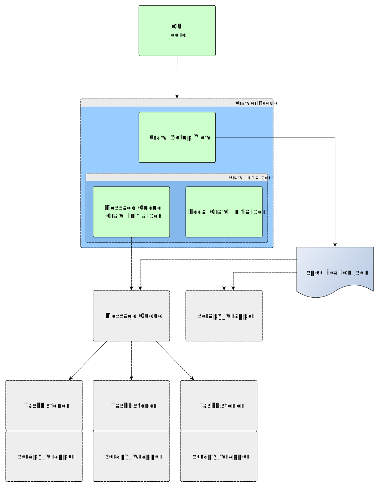
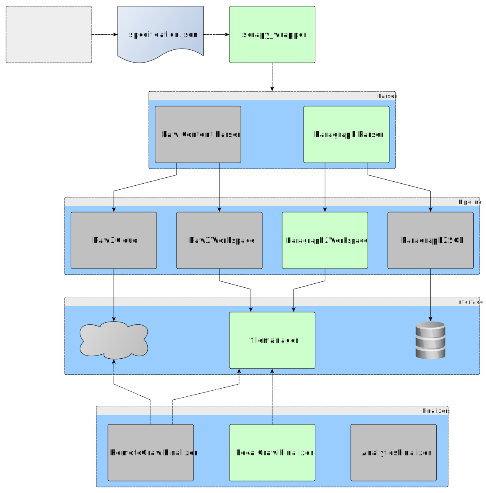

# SpiderGUI

This is a simple modular graphical endpoint for the [Scrapy](https://scrapy.org/) python web-crawler library.
It allows to issue crawls with a basic list of urls and prefix-blacklist.
It also supports several post-processing and analytical features that are heavily based on [pandas](http://pandas.pydata.org/).
The GUI and its features are specifically tailored to the german DFG research project ["Die Konstruktion organisationaler Identität und der Einfluss von Geschichte"](http://gepris.dfg.de/gepris/projekt/398074981?context=projekt&task=showDetail&id=398074981&) at the [TU Ilmenau](https://www.tu-ilmenau.de/).

# Remarks

This software is still in early development. It is primarily developed with windows users in mind.
Seeing as python, PyQt5, etc. are platform independend, it should run on unix-based systems as well, although this is not extensively tested yet.

As a user, if you encounter any bugs or unexpected behaviour, please report them through github issues.
A simple in-app documentation is still planned to 
As a developer, be aware that some of the design choices may not be fully incorporated at every level yet.
There is some code documentation, but as is to be expected of an early development stage, it is most likely insufficient to fully understand everything.
Feel free to contact me with specific questions

# Installation

The installation process might be simplified in the future, for now, several steps need to be taken.
A Python3.7 environment is required and it is recommended to obtain this through Anaconda.
1. Install [Anaconda](https://www.anaconda.com/distribution/#download-section) with python3.7.
2. Download and install Visual Studio Buildtools [here](https://visualstudio.microsoft.com/de/downloads/). (Scroll down a bit, you'll find tools for visual studio 2019, download the Buildtools)
3. Get the SpiderGUI sources.
  * Either Download [master.zip](https://github.com/MaxPensel/SpiderGUI/archive/master.zip) and unpack in your chosen installation directory.
__OR__
  * Install git and clone this repository. (This method is recommended to easily stay up to date with the development)
```ShellSession
git clone git@github.com:MaxPensel/SpiderGUI.git
```
4. Open up the anaconda prompt and navigate to your installation directory. Execute 
```ShellSession
./Install.bat
```
Even though executing batch files works with double-click as well, an activated python environment is required for this script to work, e.g. the anaconda base environment.

# Documentation

This is a preliminary documentation about the code structure and some module interactions.
First of all, the main UI (user interface) is a modular platform. The core loads the modules that are present in the ```modules``` directory and activated in the ```settings.ini```. Each module contains a main PyQt5 Widget that represents its view component. Each main widget appears as a new tab in the core UI.
There is a well documented template module that contains further information on how to implement new modules.

## Module: Crawler

For the crawler module, there are two main components, the PyQt5 UI (the main widget of the crawler module), and a wrapper script executing the scrapy crawling process (scrapy_wrapper.py).
The main widget adheres to a model view controller (MVC) structure. The view is used to configure all parameters that specify a single run of the scrapy wrapper script. The controller generates this specification in the form of a .json file and executes the scrapy wrapper script.

The crawler UI itself consists of two parts, the main control elements to construct a crawl specification and an area to set up different types of crawl initialization routines. The latter is implemented in a modular way and can be selected independendly of the former. The two initialization routines that are included currently, are
1. a local initialization, this executes the scrapy_wrapper on the same machine, using the same workspace as the UI
2. a remote message queue initializer, this sends the crawl specification json to a remote message queue to be further processed by remote task listeners



The scrapy_wrapper is standalone in the sense that it takes a run specification json file as input, to determine what urls to crawl, how to process responses, where to store retrieved data, etc. (see [specification.json]).
Components such as the parsing of incoming http-responses and further processing of the parsed data (in pipelines or finalizers) can be specified in the run specification, in order to keep extensibility of the scrapy wrapper as high as possible.



## specification.json


```JSON
{
    "blacklist": [
         "http://www.example.com/do-not-crawl-this"
    ],
    "finalizers": {
        "modules.crawler.scrapy.pipelines.LocalCrawlFinalizer": {}
    },
    "name": "sep init",
    "parser": "modules.crawler.scrapy.parsers.ParagraphParser",
    "parser_data": {
        "keep_on_lang_error": false,
        "xpaths": [
            "//p",
            "//td"
        ]
    },
    "pipelines": {
        "modules.crawler.scrapy.pipelines.Paragraph2WorkspacePipeline": 300
    },
    "urls": [
        "http://www.example.com/start-crawling-this",
        "http://www.example.com/start-crawling-that"
    ],
    "workspace": "D:\\Projects\\Crawler\\SpiderGUI\\default_workspace"
}
```

* _blacklist_: contains a list of url strings, acts as a prefix-blacklist, i.e. urls starting with any of the here specified strings will not be crawled
* _finalizers_: contains a dictionary describing the finalizers to be executed after a crawl has finished, key is path to finalizer class and value is dictionary of generic data influencing behaviour of the finalizer
* _name_: The name of the crawl.
* _parser_: path to parser class, this handles all http-responses obtained during crawling
* _parser_data_: custom data to be passed to the parser instantiation
* _pipelines_: Specifies the scrapy pipelines setting, see the [scrapy documentation](https://docs.scrapy.org/en/latest/topics/item-pipeline.html)
* _urls_: contains a list of url strings, these will be the start urls, a single scrapy crawlspider is started for each given url
* _workspace_: For now, the workspace setting is linked together with the _mode_. Soon, these options will be deferred to the pipeline setting.
* _xpaths_: contains a list of xpath expressions to fetch paragraphs from. This specification will be exclusive to "paragraph-extracting" kind of parsers.