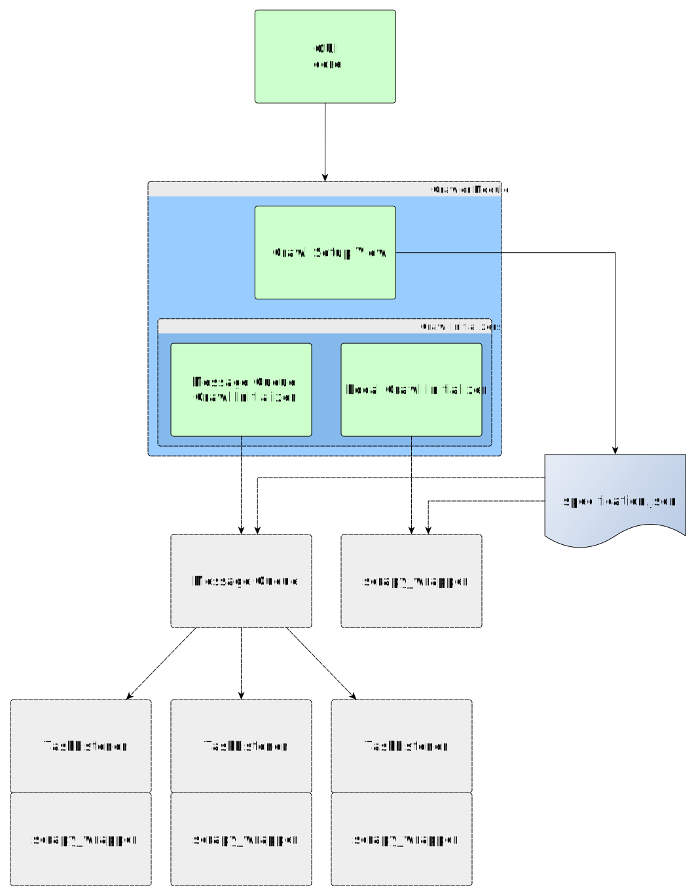

# OpenWebScraper

This is a simple modular graphical endpoint for the [Scrapy](https://scrapy.org/) python web-crawler library.
It allows to issue crawls with a basic list of urls and regex-blacklist.
It will also support several post-processing and analytical features that are heavily based on the [pandas](http://pandas.pydata.org/) library.
The graphical user interface (GUI) and its initial extent of features are
specifically tailored to the german DFG research project 
["Die Konstruktion organisationaler Identität und der Einfluss von Geschichte"](http://gepris.dfg.de/gepris/projekt/398074981?context=projekt&task=showDetail&id=398074981&)
at the [TU Ilmenau](https://www.tu-ilmenau.de/).
Hereinafter, OWS is short for OpenWebScraper.

This project comprises solely the graphical endpoint to configure the behavior of the scrapy
webscraping library. To execute crawls on your local machine, you also require
the [OWS-scrapy-wrapper](https://github.com/MaxPensel/OWS-scrapy-wrapper).


# Remarks

This software is still in early development. It is primarily developed with windows users in mind.
Seeing as python, PyQt5, etc. are platform independend, it should run on unix-based systems as well, although this is not extensively tested yet.

As a user, if you encounter any bugs or unexpected behaviour, please report them through github issues.
A simple in-app documentation is still planned to provide explanations for
the behavior of some of the UI features.

As a developer, be aware that some of the design choices may not be fully incorporated at every level yet.
There is some code documentation, but as is to be expected of an early development stage, it is most likely insufficient to fully understand everything.
Feel free to contact me with specific questions.

# Interaction with OWS-scrapy-wrapper

At this point, OWS allows only to issue local crawls. As a planned feature
OWS will be able to report crawl specifications to arbitrary endpoints via http.

To issue local crawls you need to install the standalone OWS-scrapy-wrapper
and confiure OWS so that it will be able to execute OWS-scrapy-wrapper.
This configuration must be done in

    modules/crawler/settings.toml
by setting ```scrapy_wrapper_exec``` to a command that executes the OWS-scrapy-wrapper.
The simplest option would be to provide the path to the binary file, e.g.
```C:\Path\To\OWS-scrapy-wrapper.exe```.
Hoever, you could just as well use the sources, configure your python 
environment appropriately and set

    scrapy_wrapper_exec = 'python Path\To\scrapy_wrapper.py'

# Installation from Source

Check out the latest [release](https://github.com/MaxPensel/OpenWebScraper/releases)
of OWS for windows 10, 64-bit compiled binaries. They do not require 
installation and are good-to-go.

In case you need to compile from sources, follow the directions in install_steps.txt

# Documentation

This is a preliminary documentation about the code structure and some module interactions.
First of all, the main user interface (UI) is a modular platform. 
The core loads the modules that are present in the ```modules``` 
directory and activated in the ```settings.toml```. 
Each module contains a main PyQt5 Widget that represents its view 
component. Each main widget appears as a new tab in the core UI.
There is a well documented template module that contains further information on how to implement new modules.

## Module: Crawler

The crawler module allows to create run specifications specifying an
execution of the 
[OWS-scrapy-wrapper](https://github.com/MaxPensel/OWS-scrapy-wrapper). 
Its main widget adheres to a model view controller (MVC) structure. 
The view allows to configure all parameters that specify a single run 
of the scrapy wrapper script and the controller generates this 
specification in the form of a .json file.

The crawler UI itself consists of two parts, the main control elements 
to construct a crawl specification and an area to set up different types
of crawl initialization routines. The latter is implemented in a modular
way and can be selected independendly of the former. 
The two initialization routines that are included currently, are
1. a local initialization, this executes the scrapy_wrapper on the same 
machine, using the same workspace as the UI
2. a remote message queue initializer, this sends the crawl 
specification json to a remote message queue to be further processed by
remote task listeners (This is not yet implemented fully)



For a small documentation on the .json specification, see 
[OWS-scrapy-wrapper](https://github.com/MaxPensel/OWS-scrapy-wrapper#specificationjson).

# License

This software is free of use, modification and redistribution under the terms of the GNU General Public License version 3 as published by the Free Software Foundation.
For more information view the full text of the GNU GPLv3 license in COPYING or [https://www.gnu.org/licenses/](https://www.gnu.org/licenses/).